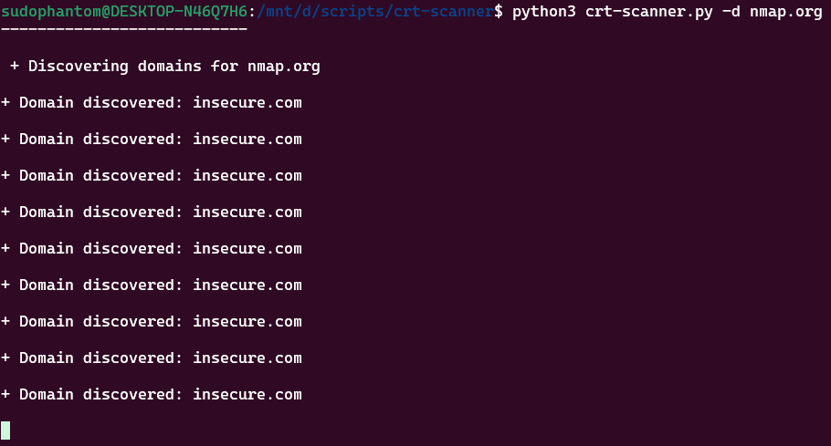

# crt-scanner
An HTTP scanning tool that leverages crt.sh and selenium.

**Because this tool uses selenium you must install the chromedriver and google chrome to use this.**
The chromedriver for google can be downloaded from  [Google](https://developer.chrome.com/docs/chromedriver/downloads).

If using Debian based linux(i.e. Debian, Ubuntu, kali) you can just update with your packagemanger.
`sudo apt-get install chromium-chromedriver`

To install on windows you must download and install to path.
in the command prompt or powershell.

`setx PATH "%PATH%;C:\bin\chromedriver"`

for more information on how to do that [Google](https://developer.chrome.com/docs/chromedriver/get-started/) has a guide.
---

```
usage: crt-scanner.py [-h] -d DOMAIN [-x EXCLUDE] [-l LIST_EXCLUDE]

OPTIONS:
  -h, --help            show this help message and exit
  -d DOMAIN, --domain DOMAIN
                        Specify Target Domain to get subdomains from crt.sh
  -x EXCLUDE, --exclude EXCLUDE
                        provide a single subdomain to exlude(optional)
  -l LIST_EXCLUDE, --list_exclude LIST_EXCLUDE
                        option to use exclusion file in list format of subdomains to exlude(optional)

Example: python3 crt-scanner.py -d google.com
```


---
### Logging
Tool will create a directory using the name of the url given, and then create files corresponding to the discovered urls based on crt.sh common names
uses selenium to take screenshots of urls it can visit.
